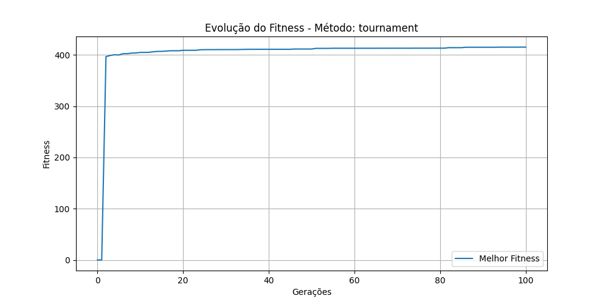

# Tech Challenge – Otimização de Layout de Escritório com Algoritmo Genético

## 📌 Descrição

Este projeto utiliza **algoritmos genéticos** para encontrar o layout ideal de mesas em um escritório, considerando restrições físicas e objetivos de otimização como distância entre mesas, aproveitamento de espaço e capacidade de cadeiras. A solução foi implementada em **Python**, com visualização do progresso por meio de gráficos usando **matplotlib**.

## 🎯 Objetivo

Organizar automaticamente um conjunto de mesas em uma planta retangular, maximizando:
- A quantidade de cadeiras no ambiente,
- A distância mínima e média entre mesas (evitando aglomerações),
- A centralização das mesas,
- A densidade e o aproveitamento do espaço.

E ao mesmo tempo respeitar:
- Restrições físicas como áreas proibidas (banheiros, paredes),
- Espaçamento mínimo entre mesas para circulação de cadeiras,
- Limites da planta (largura x altura).

## ⚙️ Como o Algoritmo Funciona

### 1. **Inicialização**
- Define-se uma população inicial com indivíduos (layouts aleatórios).
- Cada indivíduo é um conjunto de mesas com posições (x, y) e dimensões (w, h).

### 2. **Avaliação (Fitness)**
Função `fitness()` avalia a qualidade de cada layout com base em:
- Penalidades para colisões, posicionamento inválido ou sem espaço para cadeiras;
- Pontuações para capacidade de cadeiras, centralidade, distâncias, densidade de uso e número total de mesas.

### 3. **Seleção**
Três métodos de seleção são suportados:
- **Roleta (roulette)**: seleciona indivíduos com probabilidade proporcional ao fitness.
- **Torneio (tournament)**: escolhe o melhor entre grupos aleatórios.
- **Rankeamento (rank)**: seleciona com base na posição do indivíduo em um ranking.

### 4. **Crossover**
A função `crossover()` realiza cruzamento de ponto único entre dois pais, gerando dois novos filhos com combinações dos layouts.

### 5. **Mutação**
A função `mutate()` altera levemente alguns indivíduos:
- Com 70% de chance muda a posição da mesa (respeitando restrições);
- Com 30% de chance rotaciona a mesa (trocando largura/altura).

### 6. **Nova Geração**
A função `next_generation()` monta a próxima população aplicando:
- Avaliação de fitness,
- Seleção,
- Cruzamento,
- Mutação.

Critérios de parada:
- Número máximo de gerações (`max_generations`),
- Fitness desejado atingido (`target_fitness`),
- Estagnação sem melhoria (`stagnation_limit`).

### 7. **Visualização**
Ao final, o algoritmo gera um gráfico com a evolução do **melhor fitness por geração**, e salva a imagem como `fitness_plot_<metodo>.png`.

## 📊 Resultados

Os testes compararam os três métodos de seleção. O método **tournament** e **rank** apresentaram melhor desempenho, com evolução mais consistente do fitness ao longo das gerações. Já o método **roulette** mostrou flutuações maiores e menor estabilidade.

## 🖼️ Exemplo de Gráfico Gerado



## 📁 Estrutura

```
OFFICE_OPTIMIZER/
├── config/
│ └── config.json # Planta do escritório simulada (dimensões, mesas, áreas restritas)
├── core/
│ ├── genetics.py # Algoritmo genético com lógica de seleção, cruzamento e mutação
│ ├── layout.py # Funções para cálculo de distância e verificação de colisões
│ ├── simulator.py # Classe principal que executa a simulação evolutiva
│ └── utils.py # Funções auxiliares como geração de população inicial
├── docs/
│ ├── fitness_plot_rank.png # Gráfico da evolução do fitness com seleção por ranking
│ ├── fitness_plot_roulette.png # Gráfico da evolução do fitness com seleção por roleta
│ ├── fitness_plot_tournament.png # Gráfico da evolução do fitness com seleção por torneio
│ └── office_plan.png # Planta visual do escritório usada como background no Pygame
├── ui/
│ └── visualizer.py # Visualização gráfica com Pygame (desenha as mesas, áreas e interação)
├── main.py # Ponto de entrada da aplicação (inicializa e roda o simulador)
├── requirements.txt # Dependências do projeto
└── README.md # Documentação do projeto
```

## 🎮 Controles

Para melhor visualização de como o algoritmo funciona, foi adicionada a biblioteca Pygame. Para interagir, use os controles abaixo:

- `Espaço`: Pausar/continuar execução
- `R`: Reiniciar simulação
- `I`: Mostrar/ocultar painel
- `ESC`: Sair

## 🖼️ Visualização

- Verde: Mesa posicionada corretamente
- Vermelho: Mesa em posição inválida
- Azul: Banheiro
- Cinza: Área restrita (paredes)

## 📂 Como Executar

```bash
python -m venv .venv
source .venv/bin/activate
pip install -r requirements.txt
```

## ⚙️ Como rodar o projeto localmente
```bash
python main.py
```

## ⚙️ Confira o vídeo no youtube
[Algoritmos Genéticos aplicados à otimização de layout de escritório](https://www.youtube.com/watch?v=sUIuIr8SbME)